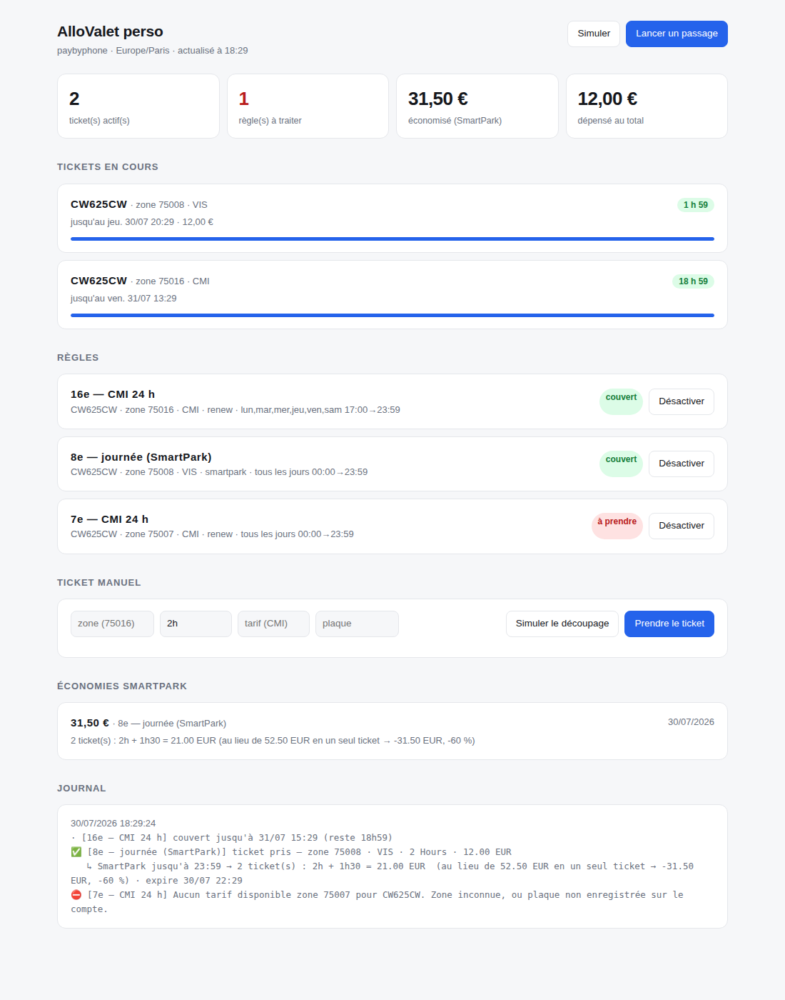

# AlloValet perso

Un ticket **CMI** dans le **75016** et le **75008**, **tous les jours à 20h01**,
tout seul. Chaque ticket dure 24 h, donc le suivant reprend le lendemain à
20h01. Rien à faire au quotidien.

## Mise en route — 3 étapes

**1. Fusionner cette branche dans `main`.**
GitHub ne déclenche les tâches planifiées **que depuis la branche par défaut**.
Tant que le code reste sur `claude/allovalet-personal-inspiration-5fnet9`, le
cron ne partira jamais.

**2. Ajouter 2 secrets.**
Repo → *Settings* → *Secrets and variables* → *Actions* → *New repository secret* :

| Nom | Valeur |
|---|---|
| `PBP_USERNAME` | ton numéro PayByPhone avec l'indicatif (`+336…`) ou ton email |
| `PBP_PASSWORD` | ton mot de passe PayByPhone |

**3. Un essai à blanc, puis c'est fini.**
Onglet *Actions* → *Stationnement 20h01* → *Run workflow*, coche **Simuler**.
Le log dit ce qu'il ferait sans rien acheter :

- `🧪 [16e — CMI 24 h] achèterait : zone 75016 · CMI · 1 Days · 0.00 €` → c'est bon,
  décoche Simuler et relance une fois pour prendre le premier vrai ticket.
- `⛔ Tarif « CMI » indisponible … Tarifs proposés : …` → le libellé exact de ton
  tarif est dans le message. Corrige `rate:` dans `config.yml`, commite, relance.

Ensuite c'est fini. Le premier ticket part le soir même à 20h01.

---

## L'horaire, concrètement

Le cron GitHub est en UTC et ignore l'heure d'été, donc le workflow se réveille
toutes les 15 min entre 18h01 et 21h46 UTC. Ça tombe sur **20h01 à Paris été
comme hiver**, et les passages suivants ne font rien si le ticket du jour est
déjà pris.

Deux conséquences utiles :

- GitHub décale souvent un déclenchement de plusieurs minutes, et saute parfois
  un passage : le suivant rattrape dans le quart d'heure.
- Si un soir le ticket part à 20h20, le lendemain à 20h01 il reste moins de
  45 min au ticket en cours, donc il est repris — l'horaire revient tout seul.

Ces deux points sont verrouillés par des tests (`tests/test_ma_config.py`) :
zones, jours, heure et couverture du cron été/hiver.

---

## Au-delà du strict nécessaire

Le moteur sait aussi faire du découpage tarifaire (SmartPark) et il y a un
tableau de bord local (`allovalet web`). **Tu n'as rien à en faire** : ce n'est
pas activé, ça ne tourne pas, et `config.yml` ne contient que les deux règles
ci-dessus. Dis-le moi si tu veux que je supprime carrément ces morceaux.

| AlloValet | Ici |
|---|---|
| Connexion au compte PayByPhone | idem (EasyPark aussi, en secondaire) |
| Règles par véhicule / zone / code tarif (CMI, résident, visiteur, pro, 2RM) | idem, en YAML |
| Renouvellement 24 h/24 | passage toutes les 30 min via GitHub Actions |
| SmartPark™ (découpe pour casser le barème progressif) | `mode: smartpark`, calculé sur les **vrais** prix de l'API |
| Tableau de bord | `allovalet web`, en local sur ta machine |
| Justificatifs | `allovalet history` (les reçus officiels restent sur le compte) |
| 6,35 €/véhicule/mois | 0 € |



---

## Pourquoi ça ne marchait pas

Deux causes, trouvées en sondant les endpoints et en lisant le bundle de
l'application PayByPhone (une app Flutter : `main.dart.js` contient en clair
les opérations GraphQL). Détail dans [docs/api-paybyphone.md](docs/api-paybyphone.md).

**1. L'API REST n'existe plus.**

```
GET consumer.paybyphoneapis.com/parking/accounts   →  404 page not found
POST consumer.paybyphoneapis.com/uapi/graphql      →  401  (vivante)
POST auth.paybyphoneapis.com/token                 →  400 invalid_grant (vivante)
```

Tout passe par **GraphQL**. Une implémentation basée sur la doc REST
reverse-engineerée de 2015 ne pouvait pas marcher, quels que soient les
identifiants.

**2. Il manquait la mutation d'achat.**

L'ancien script s'arrêtait à `createQuotesV1` et affichait `✅ Ticket OK`. Or un
devis n'achète rien. Le vrai enchaînement, celui de l'application :

```
createQuotesV1         →  un devis, et surtout un quoteId
startParkingSessionV1  →  l'achat, à partir de ce quoteId
getOpenSessionsV1      →  vérification que le ticket existe vraiment
```

C'est maintenant ce que fait le programme, et un ticket n'est déclaré pris que
lorsqu'il a été **relu depuis le serveur**. Sinon c'est une erreur, et une
notification part. (Test de non-régression : `test_achat_fantome_remonte_en_echec`.)

**Le renouvellement, en bonus.** Chaque session renvoyée par l'API porte
`isRenewable` et `renewableAfter` : elle dit elle-même quand elle peut être
reprise. Quand une session en cours est renouvelable, on passe par
`renewParkingSessionV1` au lieu d'en empiler une seconde — c'est le mécanisme
prévu, et il évite le refus « session déjà active ».

---

## Mise en route

### 1. Les identifiants

Repo GitHub → **Settings → Secrets and variables → Actions → New repository secret** :

| Secret | Valeur |
|---|---|
| `PBP_USERNAME` | numéro de téléphone (`+336…`) ou email du compte PayByPhone |
| `PBP_PASSWORD` | mot de passe PayByPhone |
| `NTFY_TOPIC` | *(facultatif)* un mot secret pour recevoir les notifications push |

> Pas de token à renouveler à la main : la connexion se fait par identifiant/mot
> de passe à chaque passage. C'est ce qui rendait les versions précédentes
> fragiles (le refresh token tournait et expirait).

### 2. Vérifier avant d'activer

En local :

```bash
pip install -r requirements.txt
cp .env.example .env          # et remplir
python -m allovalet init      # génère config.yml depuis ton compte (facultatif)
python -m allovalet doctor    # n'achète rien
```

`init` lit les véhicules du compte, propose les tarifs réellement disponibles
sur chaque zone que tu indiques, et écrit `config.yml` tout seul.

`doctor` contrôle, règle par règle : connexion, compte, véhicules, moyen de
paiement, zone joignable, tarif trouvé, prix du ticket, créneau. Il affiche les
**vrais codes tarifaires** de tes zones — corrige `rate:` dans `config.yml` si
`CMI` ne correspond pas au libellé exact.

```bash
python -m allovalet rates --zone 75016   # liste les tarifs disponibles
python -m allovalet run --dry-run        # dit ce qu'il ferait, sans acheter
```

### 3. Activer

Le workflow `.github/workflows/parking.yml` tourne **toutes les 30 minutes**.
Onglet **Actions** → *Stationnement automatique* → *Run workflow* pour un essai
manuel immédiat (case « Simuler » disponible).

---

## Les commandes

```bash
python -m allovalet web                           # tableau de bord (voir plus bas)
python -m allovalet run [--dry-run] [--loop 15]   # applique les règles
python -m allovalet status                        # tickets en cours + état des règles
python -m allovalet doctor                        # diagnostic complet
python -m allovalet init                          # génère config.yml depuis le compte
python -m allovalet vehicles                      # véhicules du compte
python -m allovalet zones 75016                   # retrouve l'id d'une zone
python -m allovalet rates --zone 75016            # tarifs d'une zone
python -m allovalet quote --zone 75016 --duration 2h
python -m allovalet plan  --zone 75008 --until 19:00   # simulation SmartPark
python -m allovalet park  --zone 75016 --duration 24h  # ticket manuel
python -m allovalet history                       # tickets passés et dépense
python -m allovalet schema                        # forme exacte attendue par l'API
python -m allovalet easypark-login                # auth EasyPark par SMS
```

`--loop 15` fait tourner la boucle en local toutes les 15 min — pratique pour
une journée précise sans dépendre de GitHub.

---

## Le tableau de bord

```bash
python -m allovalet web        # http://127.0.0.1:8777
```

C'est l'équivalent de leur interface, en local :

- tickets en cours avec le temps restant,
- état de chaque règle (couvert / à prendre / en attente / en pause),
- **mise en pause d'une règle en un clic**, sans toucher à `config.yml`
  (l'état est stocké à part, la config reste intacte),
- lancement d'un passage, en réel ou en simulation,
- ticket manuel et simulation de découpage,
- total économisé par SmartPark et journal des derniers passages.

Le serveur n'écoute que sur `127.0.0.1`, ne stocke aucun identifiant et
réutilise la configuration existante. Thème clair et sombre selon le système.

---

## La configuration

Tout est dans `config.yml` (relu à chaque passage, aucun redéploiement).

```yaml
rules:
  - name: 16e — CMI 24 h      # nom libre, sert dans les logs et notifications
    plate: AB123CD            # plaque, telle qu'enregistrée sur le compte
    location: "75016"         # numéro de zone affiché sur l'horodateur
    rate: CMI                 # id, type (CMI/PMR/RES/VIS/PRO) ou bout de nom
    mode: renew               # renew | smartpark
    duration: 24h             # renew : durée de chaque ticket
    window:                   # quand la règle a le droit d'agir
      days: [lun-sam]         # lun-sam, weekend, [sam, dim], all…
      from: "17:00"           # large : la règle n'agit que si le ticket expire bientôt
      to: "23:59"
    max_cost_per_ticket: 0    # refuse d'acheter au-dessus (0 = gratuit uniquement)
    max_cost_per_day: 40      # plafond cumulé sur la journée
    enabled: true
```

Réglages globaux : `provider` (`paybyphone` / `easypark`), `timezone`,
`renew_margin_minutes` (on renouvelle quand il reste moins que ça), `notify`.

**Le déclencheur n'est pas l'heure**, c'est l'état : *dans le créneau* **et**
*aucun ticket ne couvre l'instant présent*. Un passage raté (runner GitHub en
retard, coupure réseau) est donc rattrapé au passage suivant au lieu d'être
perdu jusqu'au lendemain — c'est le principal gain de fiabilité face à un
simple `cron` à 20h01.

---

## SmartPark

Le tarif de voirie est progressif : à Paris (1er–11e), 6 h d'affilée coûtent
~75 €, alors que 3 tickets de 2 h coûtent 3 × 12 = 36 € — chaque nouveau ticket
repart en bas du barème.

Aucun barème n'est codé en dur : le programme demande de **vrais devis** à
l'API pour chaque durée possible sur la zone et le tarif concernés, puis
cherche le découpage optimal (programmation dynamique, type « rendu de
monnaie »). À prix égal, il prend le moins de tickets possible.

```bash
python -m allovalet plan --zone 75008 --until 19:00
```

```
Barème constaté :
      1h →   6.00 €
      2h →  12.00 €
      3h →  32.50 €
      6h →  75.00 €

Pour 6h00 de stationnement :
  3 ticket(s) : 2h + 2h + 2h = 36.00 €  (au lieu de 75.00 € en un seul ticket → -39.00 €, -52 %)
```

En mode `smartpark`, le prochain morceau est **recalculé à chaque passage** à
partir du temps réellement restant : si tu pars plus tôt, rien n'est acheté en
trop.

> À vérifier sur ta ville : certaines communes font continuer le barème
> progressif sur la journée dans le même secteur, ce qui annule le gain. La
> commande `plan` te le dira, puisqu'elle lit les prix réels.

---

## Notifications

Le plus simple : l'app **ntfy** (iOS/Android, gratuite). Choisis un mot secret,
abonne-toi à ce sujet, mets-le dans le secret `NTFY_TOPIC`. Tu reçois un push à
chaque ticket pris et surtout **à chaque échec**. Telegram et un webhook
générique sont aussi supportés (voir `config.example.yml`).

---

## Garde-fous

- `max_cost_per_ticket` / `max_cost_per_day` : le devis est contrôlé **avant**
  l'achat, un dépassement bloque et notifie.
- Un ticket est confirmé uniquement s'il est relu côté serveur.
- Une règle en échec n'empêche pas les autres de s'exécuter.
- Si la zone refuse un second ticket, le ticket en cours est prolongé.
- Retry exponentiel sur les erreurs réseau et 5xx.
- `concurrency` GitHub : deux passages ne peuvent pas se chevaucher.

---

## Dépannage

| Symptôme | Cause probable |
|---|---|
| `Connexion refusée` | identifiant = numéro **avec indicatif** (`+336…`) ; mot de passe changé |
| `Tarif « CMI » indisponible` | le libellé exact diffère → `allovalet rates --zone XXXXX` |
| `Aucun tarif disponible` | mauvais numéro de zone, ou plaque absente du compte |
| `Ticket non confirmé` | l'achat a été refusé (carte expirée, tarif payant sans moyen de paiement, quota atteint) |
| Rien ne se passe la nuit | le créneau est en heure de Paris — vérifie `window` |

Les logs détaillés de chaque passage sont dans l'onglet **Actions**.
`python -m allovalet -v run` donne le détail des requêtes.

---

## Tests

```bash
pip install -r requirements-dev.txt
python -m pytest tests -q
```

80 tests, sans réseau : un faux serveur **GraphQL** rejoue le moteur réel
(connexion, jeton périmé, tarifs, devis, achat via quoteId, renouvellement,
prolongation, vérification, achat fantôme, introspection), les commandes, les
routes du tableau de bord, l'horaire réellement configuré, plus les tests
unitaires du découpage SmartPark — dont une vérification de l'optimum par
force brute.

Le rendu du tableau de bord est vérifié au navigateur (Chromium) en thème
clair et sombre : `docs/dashboard.png` et `docs/dashboard-dark.png`.

---

## Limites, dites franchement

- **Le code n'a pas encore tourné contre un vrai compte** — je n'ai pas les
  identifiants. Les endpoints, eux, ont été sondés en direct et le moteur est
  calqué sur celui de l'application. Premier vrai test : `doctor`, puis
  `run --dry-run`.
- Il reste un point non vérifiable sans compte : la forme exacte de l'entrée de
  `startParkingSessionV1`. Le client essaie les formes plausibles l'une après
  l'autre, et en cas de refus l'erreur contient **la liste des champs réellement
  acceptés**, obtenue par introspection. `allovalet schema` la donne aussi
  directement. Si ça coince, c'est une correction d'une ligne.
- L'API n'est pas publique : si elle change, `doctor` le détectera avant que ça
  coûte un PV.
- EasyPark est en secondaire : sa connexion passe par un code SMS (non
  automatisable) et l'endpoint qui liste les tickets en cours est essayé parmi
  plusieurs candidats. PayByPhone est le chemin fiable.
- Usage strictement personnel, sur ses propres véhicules et ses propres droits.
